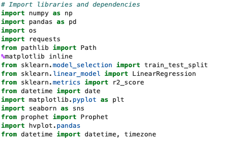
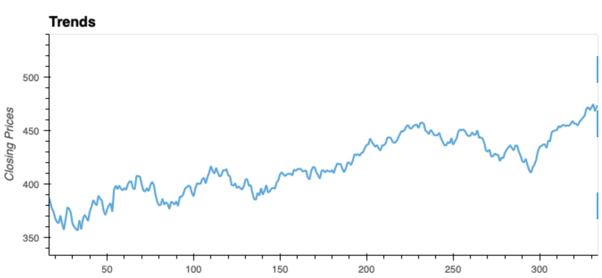

# AlgorithmicSpy
 \

# Overview 
Algorithmic Spy is a program used to explore several models to determine which algorithmic trading model has better accuracy. In this case, we will use  Neural Networks, Prophet, and SGDRegressor functions to determine whether to Sell or Buy the stock with a trading bot. 

# Importing libraries to run the code

# Models used and outcomes : 
## Neural Network Results 
 In the context of algorithmic trading, neural networks can be used for tasks such as time series forecasting, pattern recognition, and decision-making.

* The Neural Network model outcome concludes that the correlated ETFs and the federal funds rate do not imply what the S&P 500 will do in the future. The data used is not a good predictor of future closing prices for SPY as the model accuracy continues to remain under 40%.

## Prophet Results
 It is designed for analyzing time series data that display patterns on different time scales such as yearly, weekly, and daily. Prophet is particularly useful for forecasting data with strong seasonal effects and can handle missing data and outliers.

* This model goes more in depth on how the stocks will perform on a daily and weekly basis, but probably not the best to measure accuracy. 

## SGDRegressor Results 
SGDRegressor is a linear regression model that uses Stochastic Gradient Descent (SGD) optimization to find the coefficients of the linear equation that best fits the data.

The SGDRegressor concludes

* R Squared is 0.9966869581174205

* Mean Squared Error:  4.247824329495329

* RMSE:  2.0610250676533095

Interpretation of Findings:

The SGDRegressor plot shows that the actual value and the predicted value are very similar and this model can be used to efficiently predict with high accuracy of 0.998096546153373. 

The SGDRegressor model appears to be the most precise, as validated through backtesting. 

## Creators
**Jarom L.** (Lead SGDRegressor Model Programmer)

**Jahun M.** (Starter code, Data clean up)

**Khareem H.** ( Neural Networks 
Programmer)

**Daniela C.** (Prophet Model, Lead ReadMe File)

## Sources

#### Image
https://medium.com/@nomadworld/building-a-trading-bot-in-python-a-step-by-step-guide-with-examples-c6ddb7430683

https://scikit-learn.org/stable/modules/sgd.html#regression

https://www.datatechnotes.com/2020/09/regression-example-with-sgdregressor-in-python.html

https://realpython.com/gradient-descent-algorithm-python/

https://home.treasury.gov/interest-rates-data-csv-archive

https://www.eia.gov/dnav/pet/pet_pri_spt_s1_d.htm

https://fiscaldata.treasury.gov/datasets/treasury-reporting-rates-exchange/treasury-reporting-rates-of-exchange

https://www.slickcharts.com/sp500
